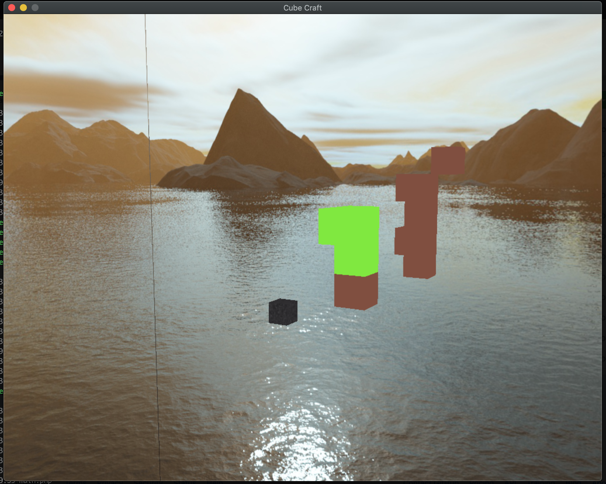

Cubecraft
=============

A proof of concept to show how PHP and OpenGL can be used to write a **Minecraft** like game.



Usage
=====

```bash
$ php main.php
```

- Click to add cubes
- `q` to quit
- `u` to undo (remove last added cube)
- `1` or `2` to alternate between brown (wood) and green (grass) materials.

